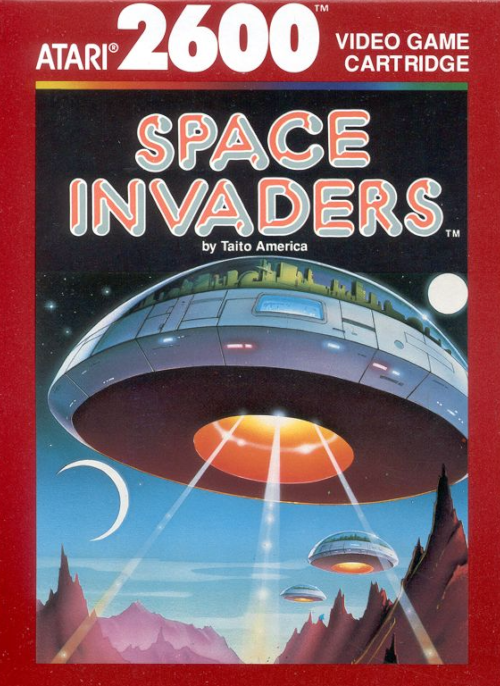

# Activity 09 - Introduction to Game Development with Pygame! 🎮

CMPSC101 :: Fall 2025

**Assigned**: 19th November 2025
**Due and Expiration date**: TBD (Cut off due date and time).



## Welcome to Game Development! 🕹️

Ready to create your own games? In this activity, you will discover the exciting world of game development using **Pygame**, a popular Python library for creating 2D games. Through hands-on tutorials, you will learn how game loops work, how to handle user input, and how to bring graphics to life on screen! 🎨

This activity is designed to give you a quick introduction to game development concepts without getting bogged down in complex code. You will follow two guided tutorials that walk you through creating simple but complete games using copy-and-paste techniques. The goal is to **see** and **understand** what makes games work!

## So, What is Pygame? 🐍

**Pygame** is a Python library that makes game development accessible and fun. It provides tools for:

- **Graphics rendering**: Draw shapes, images, and sprites on screen
- **Event handling**: Respond to keyboard, mouse, and other inputs
- **Game loops**: Control timing and animation
- **Collision detection**: Check when game objects interact
- **Sound and music**: Add audio to your games

### Why Learn Game Development?

- **Understand interactive programs**: Games respond to user input in real-time
- **Learn event-driven programming**: A fundamental concept in modern software
- **Practice problem-solving**: Game logic requires creative thinking
- **See immediate results**: Visual feedback makes programming rewarding
- **Apply programming concepts**: Loops, functions, and objects come to life

## Your Mission: Two Game Development Tutorials! 🎯

This activity includes two tutorials that progressively introduce you to Pygame concepts. The first tutorial is a simple interactive game, while the second tutorial guides you through building a (very) basic *Space Invaders* clone.

In two parts, we will cover two tutorials.

- **Part 1**: `tutorials/tutorial_01_simple_game.md`
- **Part 2**: `tutorials/tutorial_02_space_invaders.md`

### Part 1: Simple Interactive Game (~5 minutes)

**Tutorial guide**: `tutorials/tutorial_01_simple_game.md`  
**Working directory (for coding)**: `src/tutorial_01_simple_game/`

To create your first interactive Pygame program, your code will be completing the below steps.

- Set up a game window
- Handle keyboard input
- Move a circle on screen
- Understand the game loop
- Use Pygame's drawing functions

**What you will learn:**

- Basic Pygame initialization
- Event handling and keyboard input
- The game loop pattern
- Real-time updates and rendering

**Running the Game**

```bash
# Make sure you're in the root (main) directory of your project
uv run src/tutorial_01_simple_game/simple_game.py 
```

### Part 2: Space Invaders Game (~25 minutes)

**Tutorial guide**: `tutorials/tutorial_02_space_invaders.md`  
**Working directory (for coding)**: `src/tutorial_02_space_invaders/`

Build a simplified version of the classic Space Invaders game:

- Create a player-controlled spaceship
- Spawn and manage enemy invaders
- Implement shooting mechanics
- Handle collisions
- Organize code into multiple modules

**What you will learn:**
- Multi-file project structure
- Game object classes (Player, Enemy)
- Configuration management
- Module organization
- More complex game mechanics

**Running the Game**

```bash
# Make sure you're in the root (main) directory of your project
uv run src/tutorial_02_space_invaders/main.py
```

## Getting Started: Setting Up Your Environment 🛠️

We will use **UV** (a fast Python package manager) to manage our Pygame environment. UV makes it easy to install packages and run Python projects.

### Step 1: Verify UV Installation

First, check if UV is installed on your system:

```bash
uv --version
```

If you see a version number, you're good to go! If not, install UV:

```bash
# macOS/Linux
curl -LsSf https://astral.sh/uv/install.sh | sh

# Or using Homebrew on macOS
brew install uv
```

### Step 2: Navigate to Activity 09

```bash
cd /path/to/your/activity_09
```

### Step 3: You're Ready!

Each tutorial will guide you through using UV to install Pygame and run your games. The tutorials include specific UV commands for each project directory.

## Tutorial Workflow 📝

For each tutorial, you will:

1. **Read the tutorial markdown file** in the `tutorials/` directory
2. **Navigate to the appropriate `src/` subdirectory** for that tutorial to find the source files
3. **Follow the step-by-step instructions** to copy and paste code
4. **Run your game using UV commands** provided in the tutorial
5. **Observe and understand** what the code does
6. **Experiment** by making small modifications (optional but encouraged!)

### Important Notes:

- **Copy and paste carefully**: Make sure you copy complete code blocks
- **Indentation matters**: Python is sensitive to spacing and tabs
- **Read the explanations**: Understanding is more important than just copying
- **Save frequently**: Use `Cmd+S` (macOS) or `Ctrl+S` to save your files
- **Run often**: Test your code after each major addition

---

## Project Assessment

This is a **checkmark assignment**. You will receive credit for:

- Completing both tutorials
- Having working game files in both `src/` directories
- Submitting a thoughtful reflection

## 📋 Assignment Deliverables 📝

Submit the following items to your GitHub repository:

1. **Completed game files**:
   - `src/tutorial_01_simple_game/simple_game.py` - Your working simple game
   - `src/tutorial_02_space_invaders/main.py` - Space Invaders entry point
   - `src/tutorial_02_space_invaders/game.py` - Game logic
   - `src/tutorial_02_space_invaders/config.py` - Configuration settings

2. **Completed reflection document**: `writing/reflection.md` with thoughtful responses to all questions

## Submission

🚀 As you work, commit and push regularly using these commands:

```bash
git add -A
git commit -m "Complete Tutorial 1: Simple Game"
git push
```

**Important**: After pushing, visit your GitHub repository in a browser to verify your files uploaded correctly!

## Getting Help 🆘

Students with questions are encouraged to:

- **Ask in the course Discord channel** - Your classmates might have the same question!
- **Attend instructor or TL office hours** - Get one-on-one help
- **Review Pygame documentation** - https://www.pygame.org/docs/
- **Check for typos** - Most errors come from small copy-paste mistakes

Remember: Game development is challenging but rewarding. Don't get discouraged if something doesn't work the first time!

## Tips for Success 💡

1. **Read before you copy**: Understand what each code block does
2. **Test incrementally**: Run your code after adding each section
3. **Pay attention to file names**: Make sure you're editing the right file
4. **Watch for indentation**: Python requires consistent spacing
5. **Have fun**: Experiment and make the games your own!

---

**Ready to start?** Head to `tutorials/tutorial_01_simple_game.md` and begin your game development journey! 🚀

Good luck, and enjoy creating your first games with Python and Pygame! 🎮✨

````
